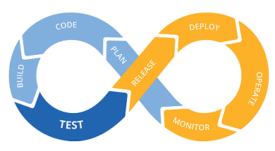

# CI/CD for Java application

This project implements **ci/cd pipeline**.

## Description

The basis of the project was taken Java application that implements the basic functions of the calculator. The following technologies have been used:
- Jenkins;
- Docker;
- Ansible.

Programming tools, in addition to the Java programming language, have been used:
- Maven;
- JUnits
- SonarQube.

## General scheme of the project

